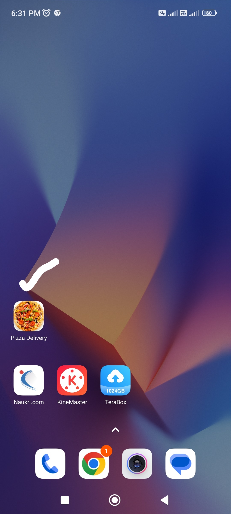
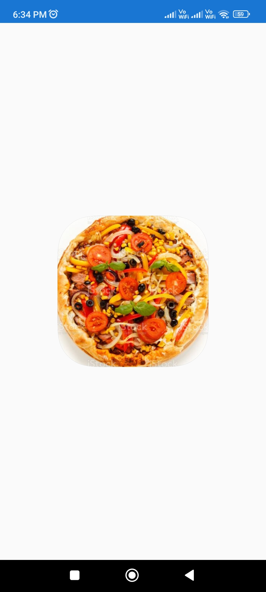
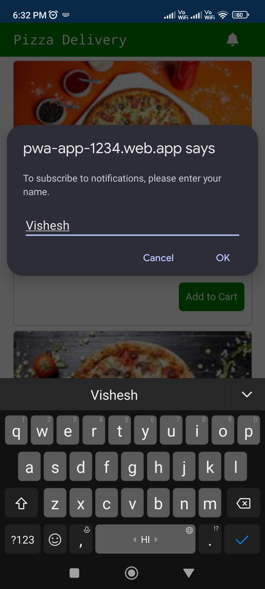
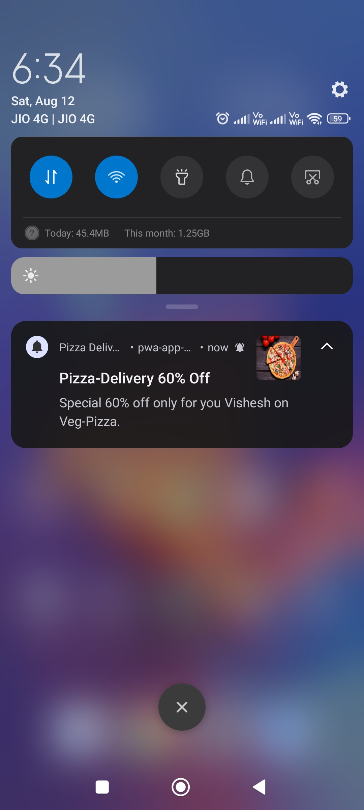
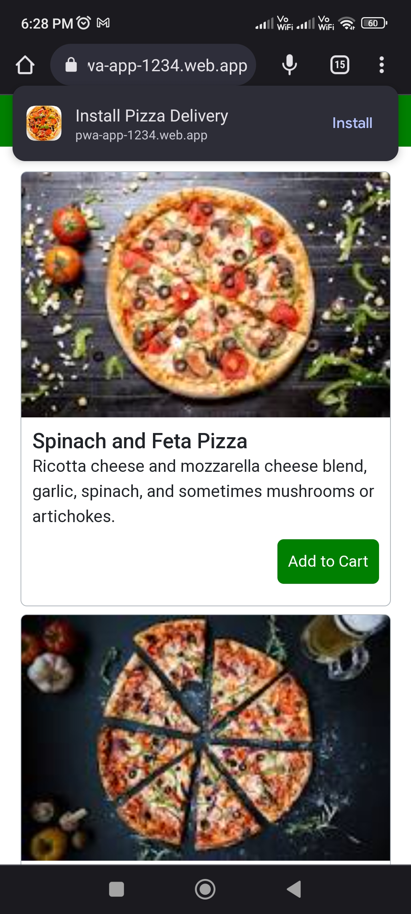

# PWA-Firestore-CRUD-NodeJs-ExpressJS
This Node App performs CRUD operation on Firestore Database using Express Framework. 
<br>
It also sends Push notifications to the end user using Firebase Cloud Messaging.
<br>
This Application provides support to the Angular PWA app https://github.com/vishesh-mahale/Angular-PWA-Firestore-CRUD 


## Setup and Installation

1. **Clone the repo from GitHub**
   ```sh
   git clone https://github.com/vishesh-mahale/PWA-Firestore-CRUD-NodeJs-ExpressJS.git
   cd PWA-Firestore-CRUD-NodeJs-ExpressJS
   npm install
   ```

2.  **Run the App**
 ```sh
  node index.js
  ```
   The above command will run the application on port 3000.

## Demo
The Nodejs App is deployed on Vercel. 
Below is the GET API to get all the Pizza Data.
<br>
https://pwa-firestore-crud-node-js-express-js-dg99-r5t32x8vy.vercel.app/api/items


## Goal
This project is mainly aimed to Perform CRUD operations on Firestore and to Showcase the feature of PWA using the powerful framework Angular. 
It has also used Node.JS, ExpressJS, CRUD, Firestore(Firebase), and REST APIs.

## Screenshots

## ⚙ Features of the Angular- Progressive Web Application:

| Step 1: Angular app gets <br> installed in our mobile <br>as native app.  | Step 2: App is opening. | Step3: Home page is displayed. |
| ------- | -------------       | - |
 |  |  |   |
 |  |  |  |
 | **Step 4: The app is asking the name <br>of the user for sending<br> the Push notification.** | **Step 5: Push Notification Received<br>from server using FCM.**| **Step 6: The app is asking the<br> permission to install the app.** |
 |  |  |   |

<br>
 
**CODE STRUCTURE:**


<br> 

**POSTMAN APIs:**


<br>  


<br>


<br>

**Firestore Database:**


<br>


<br>

## Tech Stack
 	1. Angular 16
	2. Node.JS  
	3. ExpressJS
	4. REST APIs
	5. Firebase: Firestore
    6. Firebase cloud messaging
    7. Chrome Browser
    8. Postman
    9. VS code

## Comments
This App can be reused to perform CRUD operations on Firestore.

<br>

## Postman Setup to use the APIs:

1. Goto the POSTMAN folder present inside the  PWA-Firestore-CRUD-NodeJs-ExpressJS folder.
2. Open the Postman Software.
3. Inside Postman go to the Collections Tab and import the below file from the PWA-Firestore-CRUD-NodeJs-ExpressJS folder.

```
Progressive Web App.postman_collection
```

4. Inside Postman go to the Environments Tab and import the below file from the PWA-Firestore-CRUD-NodeJs-ExpressJS folder.

```
Progressive Web Apps Env.postman_environment
```

To call this API, you will need to add the below environment variables.


**Environment Variables:**

`ID`:  ID of the Pizza item on which you want to perform an update or delete operation.  

`ServerURL`: Url on which your NodeJS app is deployed.

`URL`: Url on which your NodeJS app is deployed. 

`URLLocal`: Url on which your NodeJS app is running in locally.


## API Reference: 

#### **CRUD Operation on Firestore-Pizza**

#### Get all Pizza:
```http
 GET  /api/items
```

#### Add new Pizza:
```http
  POST /api/items

  Payload
{
    "id": "",
    "description": "Ricotta cheese and mozzarella cheese blend, garlic, spinach, and sometimes mushrooms or artichokes.",
    "name": "Spinach and Feta Pizza",
    "price": "9990",
    "vegetarian": "non_vegetarian"
}
```


#### Updata Pizza by ID:
```http
  PUT /api/items/{{ID}}

  Payload
{
    "id": "{{ID}}",
    "description": "Ricotta cheese and mozzarella cheese blend, garlic, spinach, and sometimes mushrooms or artichokes.",
    "name": "Spinach and Feta Pizza",
    "price": "99",
    "vegetarian": "non_vegetarian"
}
```

#### Delete Pizza By Id:
```http
 DELETE  /api/items/{{ID}}
```

#### **Send Push Notification:**
#### Send Push Notification by passing the tokens array and the additional parameters as a payload:
```http
  POST /sendNotifications

  Payload
	{
	    "webpush": {
	        "notification": {
	            "title": "Pizza-Delivery 60% Off",
	            "body": "Special 60% off only for you Vishesh on Veg-Pizza.",
	            "icon": "https://static.toiimg.com/thumb/msid-87930581,width-1280,resizemode-4/87930581.jpg",
	            "click_action": "https://pwa-app-1234.web.app"
	        }
	    },
	    "token": [
	       "fg77GJRy3pSPo7QIhCqIl6:APA91bEzUSIHLZmztYd1csCn_6-97_LUPtDsuxhP96n8_m6u4Y_nDkAkor7RdHxkcTOOHuDqmEJYDzf0xy2fjeOvo-6tz8lbcccaf032_jZMXMDOjI1RUH9Q7IyqXimYGIYA3jBQppOD"
	    ]
	}
```


